= Cahier De Recette - SAE Chasse au Trésor
:toc:
:toc-position: preamble
:toc-title: Sommaire
:title-page:
// :sectnums: NE PAS REACTIVER SVP
:stem: asciimath
:Entreprise: Chasse au Trésor
:Equipe:
:badge: https://img.shields.io/badge/
:test_ok: image:{badge}Test-Passé-blue.svg[]
:test_ko: image:{badge}Test-Echoué-red.svg[]
:test_wt: image:{badge}Test-En%20Attente-orange.svg[]

* Thomas Duppi
* Loélia Demany
* Loïs Pacqueteau
* Vincent Barette

Sprint 2, Janvier 2024, Groupe G3A-5

== Introduction
=== Objet
[.text-justify]
Ce document a été produit dans le cadre d'un projet d'élaboration d'une vue pour le jeu de Chasse au trésor de Quentin Vey et Adrien van den Bossche.

== Pre-Requis
[.text-justify]
L'exécution des tests spécifiés au chapitre suivant requiert :

* Un sniffeur de la chasse au trésor.
* L'environnement de test tel que spécifié dans la partie "Environnement de test" de ce document.
* Les fiches de tests. *À vérifier*

=== Éléments à tester
[.text-justify]
Les éléments testés concernent les Use-Cases spécifiées dans la https://github.com/IUT-Blagnac/sae-3-01-devapp-g3a-5/blob/master/Documentation/Documentation%20technique.adoc[documentation technique] et le https://github.com/IUT-Blagnac/sae-3-01-devapp-g3a-5[README.md] du projet.

=== Environnement de test
[.text-justify]
Ordinateur sous Windows ou OS équivalent.

== Cas de test

=== Fonctionnalités Panel Spectateur
:lvl1: 1
> Ces présents tests concernent l'IHM Spectateur - celle avec le parcours et les pions.

==== https://github.com/IUT-Blagnac/sae-3-01-devapp-g3a-5/issues/29[Equipe Connexion]
:lvl2: 1

// ///////// DEBUT DE NOUVEAU TEST ///////////
// Définissez les informations de votre test!
:num_test: 1
:nom_test: Connexion Avant Partie
:objectif: Vérifier qu'il est possible de rejoindre la partie avant son lancement

// Ne pas toucher ⬇️
:test_id: image:{badge}Test%20{lvl1}.{lvl2}-{num_test}-pink.svg[link=""]
// Ne pas toucher ⬆️

[width="300%"]
|====
>| Cas de test 4+| {test_id}
>| Titre 4+| {nom_test}
>| Objectif 4+| {objectif}
5+|

^|ID ^|Action ^|Comportement attendu ^|Pré-conditions ^|Résultat
^|{lvl1}.{lvl2}.*{num_test}.1* ^|Connecter plusieurs sniffeurs. ^|Les joueurs apparaissent après https://github.com/IUT-Blagnac/sae-3-01-devapp-g3a-5/issues/33[raffraichissement]. ^| Être sur la page index, disposer d'un sniffeur. ^|{test_ok} 
5+|image:img/test-detecter-pions.png[]
|====

// ///////// DEBUT DE NOUVEAU TEST ///////////
// Définissez les informations de votre test!
:num_test: 2
:nom_test: Connexion Pendant Partie
:objectif: Vérifier qu'il est possible de rejoindre une partie en cours

// Ne pas toucher ⬇️
:test_id: image:{badge}Test%20{lvl1}.{lvl2}-{num_test}-pink.svg[link=""]
// Ne pas toucher ⬆️

// ///////////////////////////////////////////

// ///////// DEBUT DE NOUVEAU TEST ///////////
// Définissez les informations de votre test!
:num_test: 2
:nom_test: Reset Joueur
:objectif: S'assurer que le joueur se remette bien à 0 lorsque l'on veut rejouer

// Ne pas toucher ⬇️
:test_id: image:{badge}Test%20{lvl1}.{lvl2}-{num_test}-pink.svg[link=""]
// Ne pas toucher ⬆️

[width="300%"]
|====
>| Cas de test 4+| {test_id}
>| Titre 4+| {nom_test}
>| Objectif 4+| {objectif}
5+|

^|ID ^|Action ^|Comportement attendu ^|Pré-conditions ^|Résultat

^|{lvl1}.{lvl2}.*{num_test}.1* ^|Déconnecter et reconnecter un sniffeur, puis trouver le 1er trésor. ^| Les scores et les temps sont remis à 0. ^| Ce sniffeur était connecté, mais n'avait pas encore trouvé le 1er trésor. ^|{test_ok}
^|{lvl1}.{lvl2}.*{num_test}.2* ^|Déconnecter et reconnecter un sniffeur, puis trouver le 1er trésor. ^| Les scores et les temps sont remis à 0. ^| Ce sniffeur était en train de jouer. ^|{test_ok}
^|{lvl1}.{lvl2}.*{num_test}.3* ^|Déconnecter et reconnecter un sniffeur, puis trouver le 1er trésor. ^| Les scores et les temps sont remis à 0. ^| Ce sniffeur avait terminé sa partie. ^|{test_ok}
5+|

5+|Commentaire : Lorsqu'un capteur est déconnecté, l'envoie de données est réinitialisé. Par conséquent les temps sont remis à 0 et l'ordre des capteurs est modifié peu importe son état avant la déconnexion.
|====
// ///////////////////////////////////////////

==== https://github.com/IUT-Blagnac/sae-3-01-devapp-g3a-5/issues/54[Plateau]
:lvl2: 2

// ///////// DEBUT DE NOUVEAU TEST ///////////
// Définissez les informations de votre test!
:num_test: 1
:nom_test: Plateau Vérification Couleur
:objectif: S'assurer que les couleurs sont conformes à la charte graphique

// Ne pas toucher ⬇️
:test_id: image:{badge}Test%20{lvl1}.{lvl2}-{num_test}-pink.svg[link=""]
// Ne pas toucher ⬆️

[width="300%"]
|====
>| Cas de test 4+| {test_id}
>| Titre 4+| {nom_test}
>| Objectif 4+| {objectif}
5+|

^|ID ^|Action ^|Comportement attendu ^|Pré-conditions ^|Résultat

^|{lvl1}.{lvl2}.*{num_test}.1* ^|Ouvrir la page utilisateur/spectateur. ^|Le plateau alterne deux couleurs. ^| Le plateau est généré. ^|{test_ok}
5+|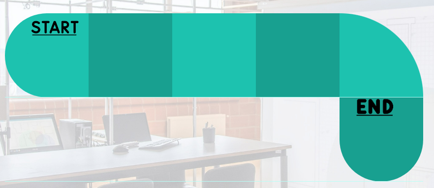
|====

// ///////// DEBUT DE NOUVEAU TEST ///////////
// Définissez les informations de votre test!
:num_test: 2
:nom_test: Plateau Intégrité Couleur
:objectif: S'assurer que les couleurs du plateau ne changent jamais (qu'il n'y a pas d'aléatoire dans la fonction)

// Ne pas toucher ⬇️
:test_id: image:{badge}Test%20{lvl1}.{lvl2}-{num_test}-pink.svg[link=""]
// Ne pas toucher ⬆️

[width="300%"]
|====
>| Cas de test 4+| {test_id}
>| Titre 4+| {nom_test}
>| Objectif 4+| {objectif}
5+|

^|ID ^|Action ^|Comportement attendu ^|Pré-conditions ^|Résultat

^|{lvl1}.{lvl2}.*{num_test}.1* ^|Ouvrir plusieurs pages utilisateur/spectateur. ^|Le plateau ressemble toujours à la même chose. ^| Au moins 1 checkpoint est connecté ou simulé. ^|{test_ok}
5+|

5+|Commentaire : Le plateau est toujours généré de la même manière par conséquent il ne changera jamais.
|====

// ///////////////////////////////////////////

// ///////// DEBUT DE NOUVEAU TEST ///////////
// Définissez les informations de votre test!
:num_test: 3
:nom_test: Plateau Adaptation Taille
:objectif: Vérifier que la taille du plateau s'adapte au nombre de checkpoints connectés ou simulés

// Ne pas toucher ⬇️
:test_id: image:{badge}Test%20{lvl1}.{lvl2}-{num_test}-pink.svg[link=""]
// Ne pas toucher ⬆️

[width="300%"]
|====
>| Cas de test 4+| {test_id}
>| Titre 4+| {nom_test}
>| Objectif 4+| {objectif}
5+|

^|ID ^|Action ^|Comportement attendu ^|Pré-conditions ^|Résultat

^|{lvl1}.{lvl2}.*{num_test}.1* ^|Ouvrir la page utilisateur/spectateur. ^|Le plateau dispose de 6 cases. ^| 6 checkpoints sont connectés ou simulés (pour 6 cases). ^|{test_ok}
5+| 
^|{lvl1}.{lvl2}.*{num_test}.2* ^|Ouvrir la page utilisateur/spectateur. ^|Le plateau dispose de 10 cases. ^| 9 checkpoints sont connectés ou simulés (pour 10 cases). ^|{test_ok}
5+|  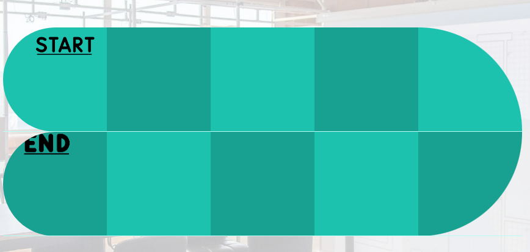
|====

==== Avancement des Pions
:lvl2: 3

// ///////// DEBUT DE NOUVEAU TEST ///////////
// Définissez les informations de votre test!
:num_test: 1
:nom_test: Avancement des pions
:objectif: S'assurer que les pions des joueurs avancent au fur et à mesure de leur progression.

// Ne pas toucher ⬇️
:test_id: image:{badge}Test%20{lvl1}.{lvl2}-{num_test}-pink.svg[link=""]
// Ne pas toucher ⬆️

[width="300%"]
|====
>| Cas de test 4+| {test_id}
>| Titre 4+| {nom_test}
>| Objectif 4+| {objectif}
5+|

^|ID ^|Action ^|Comportement attendu ^|Pré-conditions ^|Résultat

^|{lvl1}.{lvl2}.*{num_test}.1* ^|Trouver un checkpoint avec Sniffeur 1. ^|Le pion se déplace sur la case suivante. ^| Sniffeur 1 est connecté. ^|{test_ok}

5+| Les pions sont sur la ligne de départ et quelques uns on déjà avancés 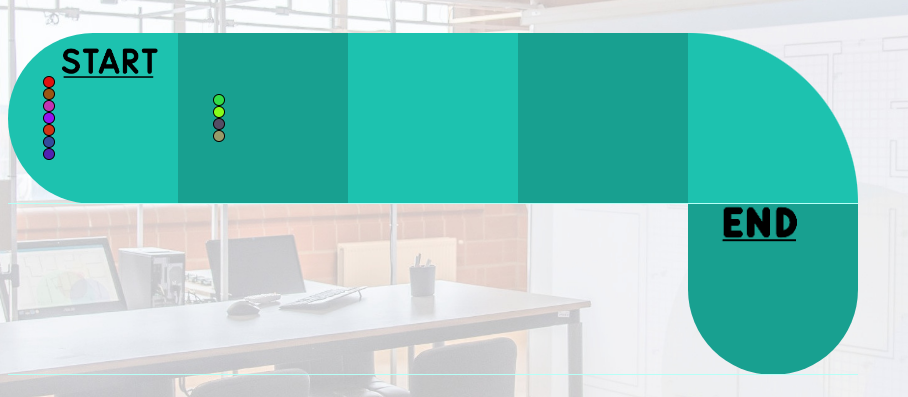

5+| Tous les pions sont entrain d'avancés jusqu'à ce qu'il est trouvé tous les cpateurs 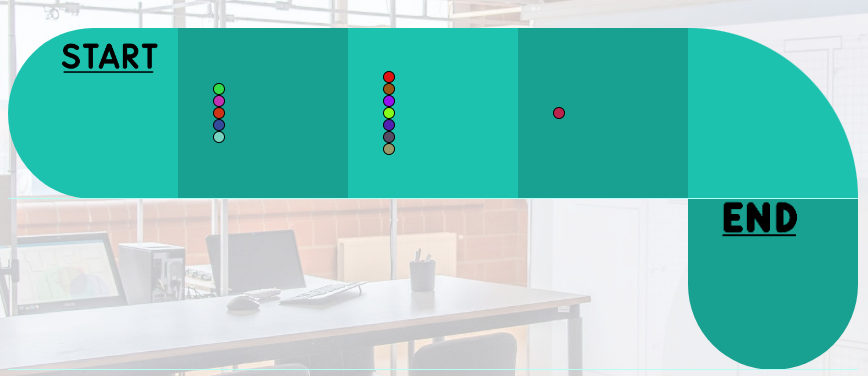
|====

=== Fonctionnalités Panel Admin
:lvl1: 2
> Ces présents tests concernent l'IHM Administrateur - celle avec les différents tableaux.

==== Menu Pause
:lvl2: 1

// ///////// DEBUT DE NOUVEAU TEST ///////////
// Définissez les informations de votre test!
:num_test: 1
:nom_test: Bouton Pause
:objectif: S'assurer que le bouton Pause est effectif

// Ne pas toucher ⬇️
:test_id: image:{badge}Test%20{lvl1}.{lvl2}-{num_test}-pink.svg[link=""]
// Ne pas toucher ⬆️

[width="300%"]
|====
>| Cas de test 4+| {test_id}
>| Titre 4+| {nom_test}
>| Objectif 4+| {objectif}
5+|

^|ID ^|Action ^|Comportement attendu ^|Pré-conditions ^|Résultat

^|{lvl1}.{lvl2}.*{num_test}.1* ^|Appuyer sur le bouton pause. ^|Le mode pause s'active. ^| Être sur la page admin, ne pas être en pause. ^|{test_ok}
^|{lvl1}.{lvl2}.*{num_test}.2* ^|Appuyer sur le bouton pause. ^|Le mode pause s'arrête. ^| Être sur la page admin, être en pause. ^|{test_ok}
5+| image:img/pause.png[]
5+|Commentaire : Le bouton pause n'as pas de réel effet sur la partie. La lecture des données continue et les scores sont mis à jour. Seul l'affichage des données est stoppé. Lorsque l'on reclique sur le bouton pause, l'affichage des données reprend et l'interface admin est réutilisable.
|====

// ///////// DEBUT DE NOUVEAU TEST ///////////
=== Fonctionnalités Accueil

:lvl1: 3
Il s'agit du panel par défaut, qui permet de s'assurer que le jeu est prêt, avant de le lancer.

==== https://github.com/IUT-Blagnac/sae-3-01-devapp-g3a-5/issues/67[Accès Port Série]

:lvl2: 1

// ///////// DEBUT DE NOUVEAU TEST ///////////
// Définissez les informations de votre test!
:num_test: 1
:nom_test: Accès Port Série
:objectif: Accéder au port série et lire des données

// Ne pas toucher ⬇️
:test_id: image:{badge}Test%20{lvl1}.{lvl2}-{num_test}-pink.svg[link=""]
// Ne pas toucher ⬆️

[width="300%"]
|====
>| Cas de test 4+| {test_id}
>| Titre 4+| {nom_test}
>| Objectif 4+| {objectif}
5+|

^|ID ^|Action ^|Comportement attendu ^|Pré-conditions ^|Résultat

^|{lvl1}.{lvl2}.*{num_test}.1* ^|Démarrer l'outil de sélection de port série avec le bouton puis choisir le port série. ^|Des données apparaissent dans la console JS. ^|Être sur la page index, utiliser Google Chrome. ^|{test_ok}
5+| 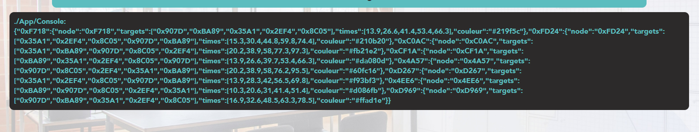
|====

==== https://github.com/IUT-Blagnac/sae-3-01-devapp-g3a-5/issues/62[Données Admin]
:lvl2: 2

// ///////// DEBUT DE NOUVEAU TEST ///////////
// Définissez les informations de votre test!
:num_test: 1
:nom_test: Données Conformes
:objectif: Vérifier que les données du port série sont conformes

// Ne pas toucher ⬇️
:test_id: image:{badge}Test%20{lvl1}.{lvl2}-{num_test}-pink.svg[link=""]
// Ne pas toucher ⬆️

[width="300%"]
|====
>| Cas de test 4+| {test_id}
>| Titre 4+| {nom_test}
>| Objectif 4+| {objectif}
5+|

^|ID ^|Action ^|Comportement attendu ^|Pré-conditions ^|Résultat

^|{lvl1}.{lvl2}.*{num_test}.1* ^|Connecter le port série au site web et ouvrir la console JS. ^|Les données apparaissent sous la forme d'un dictionnaire avec en clé la node et en value le json complet avec la couleur. ^|Être sur la page index, utiliser Google Chrome. ^|{test_ok}
5+| 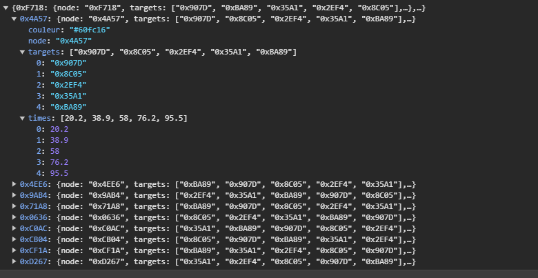

5+|Commentaire : La couleur est généré de manière aléatoire lors de la reception d'un nouveau joueur puis cette couleur est ajouté au json.
|====

// ///////////////////////////////////////////

==== Rapport JSON
:lvl2: 3

// ///////// DEBUT DE NOUVEAU TEST ///////////
// Définissez les informations de votre test!
:num_test: 1
:nom_test: Téléchargement Rapport JSON/PDF
:objectif: S'assurer que le rapport JSON/PDF se télécharge.

// Ne pas toucher ⬇️
:test_id: image:{badge}Test%20{lvl1}.{lvl2}-{num_test}-pink.svg[link=""]
// Ne pas toucher ⬆️

[width="300%"]
|====
>| Cas de test 4+| {test_id}
>| Titre 4+| {nom_test}
>| Objectif 4+| {objectif}
5+|

^|ID ^|Action ^|Comportement attendu ^|Pré-conditions ^|Résultat

^|{lvl1}.{lvl2}.*{num_test}.1* ^|Appuyer sur le bouton de téléchargement du JSON. ^|Le téléchargement est lancé. ^| Être sur la page admin, avoir une partie lancée et avancée. ^|{test_ok}
^|{lvl1}.{lvl2}.*{num_test}.2* ^|Appuyer sur le bouton de téléchargement du PDF. ^|Le PDF est téléchargé. ^| Être sur la page admin, avoir une partie lancée et avancée. Être connecté à Internet. ^|{test_ok}
5+| Voici les boutons permettants de générer les rapports : 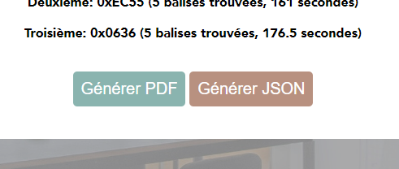
5+| Les rapports sont bien téléchargés après avoir cliqué sur les boutons : 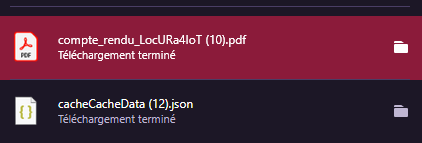
|====

// ///////// DEBUT DE NOUVEAU TEST ///////////
// Définissez les informations de votre test!
:num_test: 2
:nom_test: Qualité Rapport JSON
:objectif: S'assurer que le rapport JSON est bien formaté.

// Ne pas toucher ⬇️
:test_id: image:{badge}Test%20{lvl1}.{lvl2}-{num_test}-pink.svg[link=""]
// Ne pas toucher ⬆️

[width="300%"]
|====
>| Cas de test 4+| {test_id}
>| Titre 4+| {nom_test}
>| Objectif 4+| {objectif}
5+|

^|ID ^|Action ^|Comportement attendu ^|Pré-conditions ^|Résultat

^|{lvl1}.{lvl2}.*{num_test}.1* ^|Lire manuellement les données d'un JSON. ^|Les données sont conformes aux besoins du client. ^| Avoir un JSON ouvert sur un outil de développement. ^|{test_ok}
5+| Commentaire : Aucun commentaire.
5+| Voici un exemple de JSON : image:img/json.png[]
|====

==== Fonctionnement case Trouvé
:lvl2: 4

// ///////// DEBUT DE NOUVEAU TEST ///////////
// Définissez les informations de votre test!
:num_test: 1
:nom_test: Avancement des pions
:objectif: S'assurer que les pions des joueurs avancent au fur et à mesure de leur progression.

// Ne pas toucher ⬇️
:test_id: image:{badge}Test%20{lvl1}.{lvl2}-{num_test}-pink.svg[link=""]
// Ne pas toucher ⬆️

[width="300%"]
|====
>| Cas de test 4+| {test_id}
>| Titre 4+| {nom_test}
>| Objectif 4+| {objectif}
5+|

^|ID ^|Action ^|Comportement attendu ^|Pré-conditions ^|Résultat

^|{lvl1}.{lvl2}.*{num_test}.1* ^|Trouver un checkpoint avec Sniffeur 1. ^|L'IHM indique sur le tableau que l'équipe correspondant au Sniffeur 1 a trouvé le premier checkpoint. ^| Sniffeur 1 est connecté. ^|{test_ok}

5+| Voici le tableau avant la découverte du premier checkpoint : 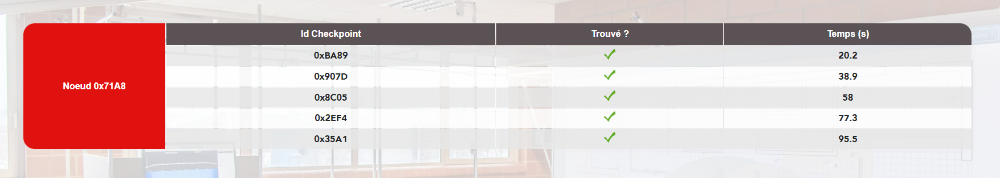
|====

=== Fonctionnalités Diverses
:lvl1: 4

==== Messages aux spectateurs
:lvl2: 1

// ///////// DEBUT DE NOUVEAU TEST ///////////
// Définissez les informations de votre test!
:num_test: 1
:nom_test: Envoi d'un message
:objectif: S'assurer que le message est envoyé

// Ne pas toucher ⬇️
:test_id: image:{badge}Test%20{lvl1}.{lvl2}-{num_test}-pink.svg[link=""]
// Ne pas toucher ⬆️

[width="300%"]
|====
>| Cas de test 4+| {test_id}
>| Titre 4+| {nom_test}
>| Objectif 4+| {objectif}
5+|

^|ID ^|Action ^|Comportement attendu ^|Pré-conditions ^|Résultat

^|{lvl1}.{lvl2}.*{num_test}.1* ^|Envoyer un message aux spectateurices. ^|Le message s'envoie. ^| Être sur la page admin. ^|{test_ok}
5+| Choix du message : 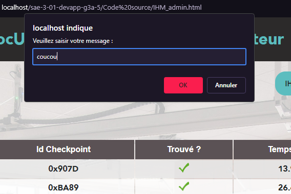
|====

// ///////// DEBUT DE NOUVEAU TEST ///////////
// Définissez les informations de votre test!
:num_test: 2
:nom_test: Réception d'un message
:objectif: S'assurer que le message est correctement reçu

// Ne pas toucher ⬇️
:test_id: image:{badge}Test%20{lvl1}.{lvl2}-{num_test}-pink.svg[link=""]
// Ne pas toucher ⬆️

[width="300%"]
|====
>| Cas de test 4+| {test_id}
>| Titre 4+| {nom_test}
>| Objectif 4+| {objectif}
5+|

^|ID ^|Action ^|Comportement attendu ^|Pré-conditions ^|Résultat

^|{lvl1}.{lvl2}.*{num_test}.1* ^|Envoyer un message "coucou", puis se rendre sur la page des spectateurs. ^|Le message est visible sur la page des spectateurs. ^| Être sur la page admin. ^|{test_ok}
5+| Réception du message : 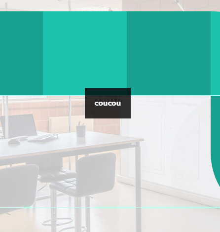
^|{lvl1}.{lvl2}.*{num_test}.2* ^|Envoyer un message "Voix ambiguë d’un cœur qui, au zéphyr, préfère les jattes de kiwis.", puis se rendre sur la page des spectateurs. ^|Le message est visible sur la page des spectateurs, et ne comporte pas d'erreur UTF-8. ^| Être sur la page admin. ^|{test_ok}

5+| Réception du message : 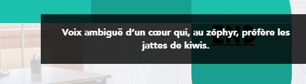
|====

