= Documentation Technique
:toc: macro
:toclevels: 3
:toc-title: 
:numbered:

Réalisé par *Thomas Duppi, Loïs Pacqueteau, Vincent Barette, Loélia Demany*

Documentation technique pour le projet de chasse au trésor LocuraIoT

== Sommaire

toc::[]

== Cas d'utilisation général

image::img/usecase.png[]

== Déploiement du projet 

=== Prérequis
Pour developper l'application, il faut télécharger VScode pour déployer le projet sur sa propre machine, et l'héberger localement. N'importe quel autre IDE peut être utilisé, mais nous recommandons VScode.

https://code.visualstudio.com/download[Lien de telechargemnt Visual Studio Code]

=== Lancement

Une fois VSCode installé, il  suffit de cloner le dépôt GitHub dans un dossier, puis d'ouvrir ce dossier dans l'IDE. Ensuite, on peut telecharger l'extension Live Server pour Visual Studio Code, qui permet de lancer le projet sur un serveur local. Il suffit ensuite de cliquer sur "Go Live" dans la barre d'état de Visual Studio Code pour lancer le projet sur le serveur local. Le projet est maintenant déployé sur votre machine.

> /!\ Le projet doit être utilisé avec Google Chrome pour être compatible.

== Architecture Système

image::img/architecture.png[width=500, height=375]

=== Dossier du Code Source (`CodeSource`)

Ce dossier contient l'ensemble du code source de l'app.

=== FICHIER HTML

La gestion des données est réalisée en html. Les données sont stockées dans des fichiers JSON, eux memes stockés dans le local storage du navigateur.

==== `index.html`

Il s'agit de la page d'accueil du projet. C'est elle qui demande l'accès au port série, et qui gère la communication avec le matériel du jeu.

==== `IHM_admin.html`

Fichier HTML responsable de l'interface utilisateur administrateur.
Gère l'affichage des informations administratives et des statistiques du jeu.
Il permet d'accéder à l'IHM utilisateur.

==== `IHM_user.html`

Fichier HTML responsable de l'interface utilisateur pour les joueurs.
Gère l'affichage de l'interface de jeu, de la progression globale des joueurs, etc.

==== `index.html`

Fichier HTML responsable du lancement du jeu.
Gère l'affichage des sniffeurs et checkpoints connectés, bouton pour démarrer le jeu.

=== `Assets`

Ce dossier contient des ressources utilisées par l'application.

==== `admin.css` & `user.css`

Fichiers CSS contenant les styles de l'application.

==== Dossier `images`

Contient les images utilisées dans l'IHM, telles que des icônes, des logos, etc.

==== Dossier `js`

Ce dossier contient le fichier JavaScript nécessaires pour l'IHM.

===== `locura4iot.js`

Contient toutes les fonctions Javascript du projet.

==== Communication avec les Données du Jeu via Web Serial

Le fichier JavaScript (`locura4iot.js`) utilise la Web Serial API pour établir une communication avec le matériel du jeu.

== Plateau

=== Taille plateau

La taille du plateau s'adapte automatiquement au nombre de checkpoints. En effet, lorsque l'on se trouve sur la page d'accueil (index), et qu'on souhaite accéder au plateau du jeu, le Javascript de la page d'accueil fournit le nombre de cases. Le plateau est en réalité un tableau, dont l'apparance est modifiée avec du CSS. Lorsque la page se charge, le javascript crée le tableau et lui attribue non seulement le bon nombre de case, mais aussi dans le bon ordre.

image::img/plateau6.png[Plateau de taille 6]

image::img/plateau11.png[Plateau de taille 11]

Le plateau de jeu depends du nombre de balises cachées, il fonctionne avec un tableau html adapté en Javascript. Le seul soucis rencontré a été la génération du tableau car elle se fait de gauche a droite, or notre plateau doit avoir une forme en serpentin si on a beaucoup de balise donc les lignes pair se gererait mal avec se fonctionnement, la fonction *position* sert donc a attribué l'ordre des balises td correctement pour pouvoir donner le bon style a chaque td.

Code de la generation du tableau:

image:img/adaptationtable.png[width=420, height=420]

=== Couleur Plateau

En harmonie avec la taille du plateau, la couleur du plateau est très importante. Elle permet d'améliorer la visibilité et la compréhension du jeu, et surtout l'accessibilité. La couleur du plateau est une échelle de bleu, conformément à la charte graphique du client. Les cases partent d'un bleu clair, à un bleu foncé, pour revenir au clair. Cela fait une boucle.

image::img/plateau6.png[Plateau de taille 6]

La fonction color retourne un string qui sert de classe dans le Javascript afin que le css change la couleur de la balise HTML `td`.

La fonction color: 

image:img/fonction-color.png[]

L'utilisation dans le code:

image:img/fonction-color2.png[]

Le css:

image:img/fonction-color3.png[]

=== Pions

==== Création des pions

Lorsqu'un joueur se connecte au jeu, un pion est créé et une couleur est attribué au pion. Le pion est implémenté sous forme d'un cercle et est immédiatement placé sur la case *Start*. Il est important de noter qu'un joueur peut se connecter pendant une partie. Le pion doit donc pouvoir être ajouté en milieu de partie.

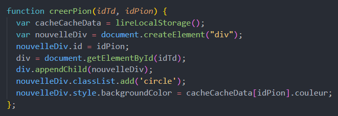

La fonction prend en paramètre la case dans lequel le pion doit se trouver qui correspond au nombre de capteur trouvé et la node du joueur. La fonction va donc créer une div qui prend pour id la node du pion. Ensuite on récupère la casse dans laquelle le pion doit se trouver et on lui ajoute la div du pion. Enfin on ajoute la classe 'circle' afin de tranformer le pion en cercle puis on lui mets la couleur du joueur.

==== Déplacement des pions

Le déplacement est pions est une variable difficile à intégrer correctement au jeu, mais qui est tout de même importante. Les pions doivent se déplacer qu'une case à l'autre, *sans altérer la taille du plateau*. Cela peut-être très contraignant puisque par défaut, les tableaux HTML sont fait pour adapter leur taille à la quantité d'information que chacune de ses cellules contient.

La solution trouvée pour résoudre ce problème est de déplacer le de case en case sans duplication.

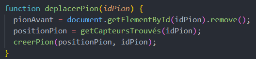

La fonction prend en paramètre la node du joueur et donc l'id du pion. D'abord on récupère la case dans laquelle le pion se trouve puis on supprime le pion de cette case. Ensuite on appelle la fonction *createPion* pour créer le pion dans la case correspondant au nombre de capteur trouvé. Si le nombre de capteur trouvé à augmenter le pion est déplacé sinon il reste sur la même case.

== Classement & Podium
=== Classement

Le classement est une fonctionnalité importante du jeu. Il permet aux joueurs de savoir où ils en sont dans la partie, et de se motiver à continuer. Il est donc important que le classement soit visible en permanence, et qu'il soit mis à jour en temps réel.

On a donc une fonction creerClassement qui va calculer le classement de chaque joueur et les afficher dans l'ordre dans le tableau du classement. Pour calculer le classement on va trier le tableau des joueurs en fonction du nombre de capteur trouvé. En cas d'égalité on va trier en fonction du temps. 

Le code de la fonction creerClassement:

image:img/creerclassement.png[]

Fonction pour l'affichage du classement dans l'hthml:

image:img/creerclassementHTML.png[]

=== Podium
Le podium s'affiche automatiquement pendant la partie. A la fin de la partie? Une pop-up de score avec la posibilité de telecharger le PDF/JSON. Accesoirment, des confettis s'affichent sur l'écran a l'apparition de la popUp.On utilise la librairie *animejs*.

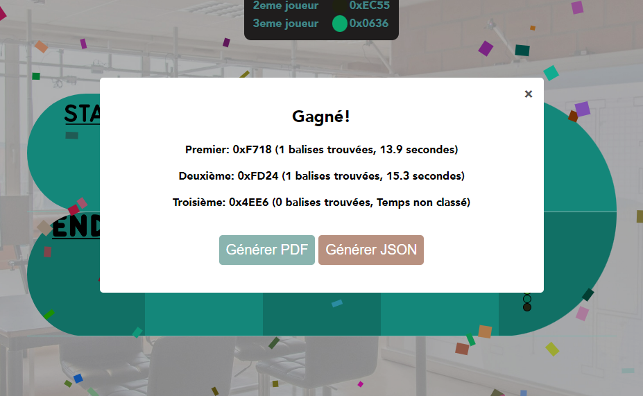

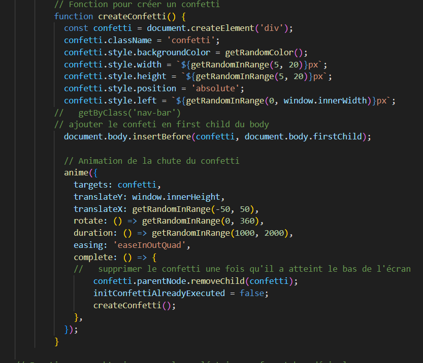

== Génération du PDF de fin de partie

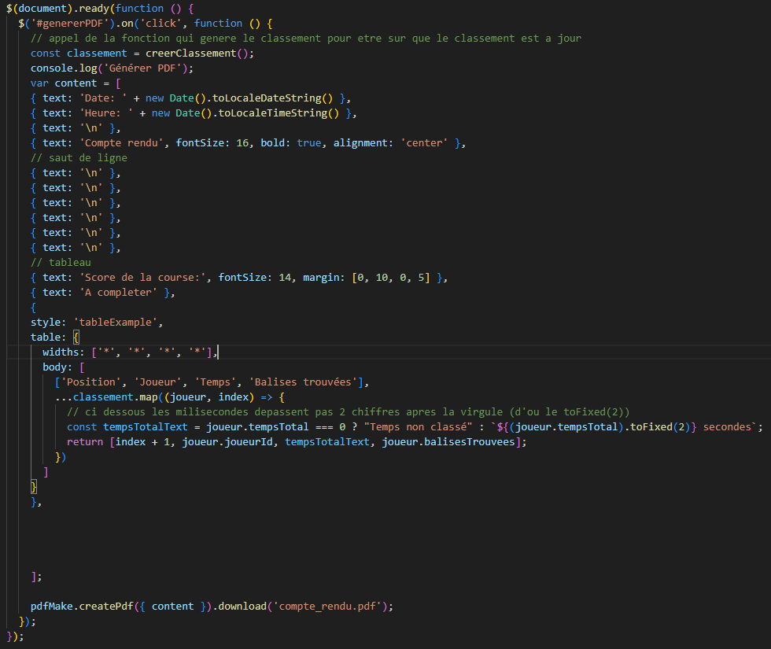

Fonctionalité disponible dans l'interface utilisateur, elle permet de generer un pdf contenant les données de la partie en cours.
Pour generer le pdf on utilise la librairie pdfmake qui permet de generer un pdf facilement en javascript. On a donc un "event listener" sur le bouton qui permet de generer le pdf a partir des données du jeu.

Résultat:

image:img/pdf.png[width=300, height=300]

== Génération du JSON de la partie

image:img/genererJSON.png[width=300, height=300]

cette fonctionnalité disponible dans l'interface administrateur et user (à la fin) permet de générer un fichier json contenant les données de la partie en cours. Pour générer le json on utilise la fonction JSON.stringify() qui permet de convertir un objet javascript en json. On aura clairement pu mettre directement les données dans un objet json mais on a préféré faire comme ça pour que le code soit plus lisible( le json est mis a la ligne ).

Resultat:

image:img/json.png[width=250, height=250]

=== Console JSON

La "console JSON" est en fait une div, elle permet de visualiser les données de la partie en cours. Elle est disponible dans l'index.  Elle est mise a jour chaque 5miniseconde par un setInterval. 

le code:

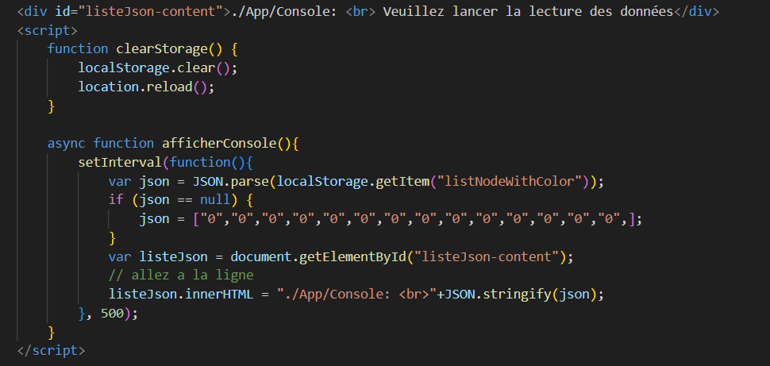

le resultat:

image:img/console.png[]

== Données Admin

Dans le local storage sont sauvegardées les données des équipes (utilisables par les admins) et écrites par la page index (cf. Accès Port Série) ci-dessous.
Les données (sous forme de JSon) sont toutes sauvegardés dans la variable "listNodeWithColor".

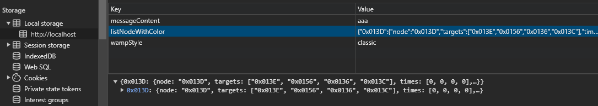

=== Contrôle du jeu en continu
Dès qu'un changement est détecté dans la listNodeWithColors contenue dans le local storage, une fonction s'active permettant d'identifier la nature de ces changements et d'agir en conséquence : 

* Si c'est une nouvelle équipe,
* Si une équipe a trouvé une nouvelle balise,
* Si une équipe s'est déconnectée,
* Si une équipe s'est reconnectée.

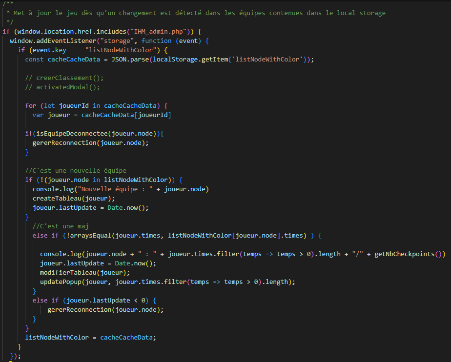

=== Clear du Local Storage

un simple bouton qui permet de clear le local storage, il est disponible dans l'index.html

le code:

Resultat: ca vide le local storage et recharge la page.

== Gestion des tableaux

=== Création des tableaux 

Au chargement de la page administrateur, on créée les tableaux de toutes les équipes stockées dans le local storage.

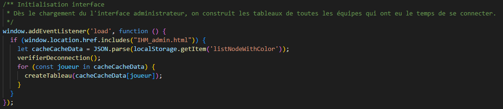

Lorsqu'une nouvelle équipe se connecte, on créée son tableau récapitulatif qui sera affiché en temps réel (sans rafraîchissement de la page) sur l'interface administrateur. Pour savoir si une équipe est nouvelle, on vérifie si sa node est utilisée comme clé de la variable listNodeWithColor contenue dans le localstorage. Le cas échéant, on créée sa table de a à z :

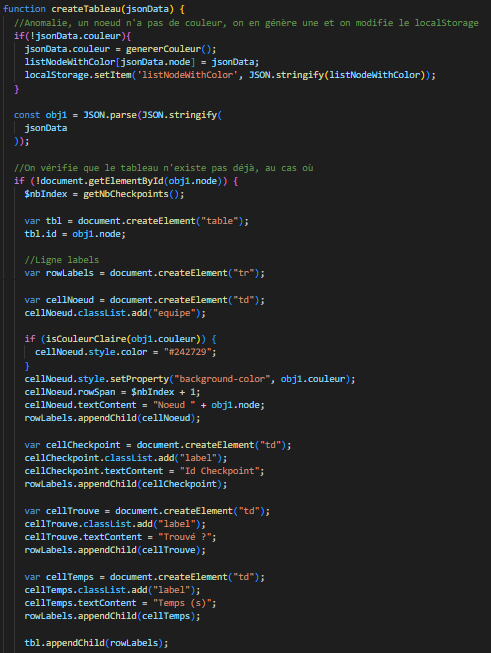

On créée la première colonne qui affiche le nom de l'équipe (avec sa couleur) et l première ligne contenant les labels des colonnes.

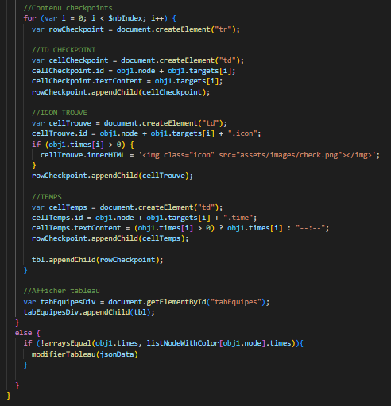

Maintenant, on rempli le tableau. Dans la première colonne, on insère les ids des nodes, dans la deuxième, une symbole "check" si elle a été trouvé, et le temps si elle a été trouvé. Dans le cas contraire, on affiche "--:--" dans la colonne des temps. On affecte à chaque cellule un id unique qui nous servira à modifier le tableau pour correspondre au progrès de l'équipe.

Voici le résultat final :

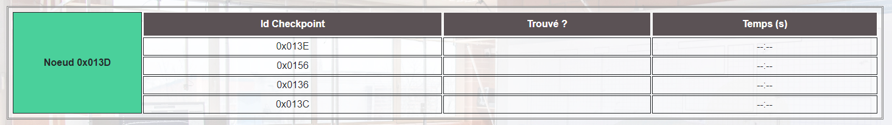

=== Modification des tableaux 

On récupère le Json de l'équipe qui a trouvé un ou plusieurs nouveaux capteurs. Pour chaque ligne, on récupère la cellule de la colonne trouvé et la cellule contenant le temps correspondantes.
Si le temps est supérier à 0, alors on insère le temps et on affiche une icône checked. 

S'actualise au rechargement de la page.

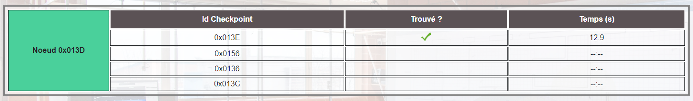
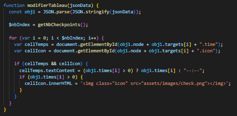

=== Vérifier la connection des tableaux 

La fonction "verifierDeconnection" est une fonction activée toutes les secondes qui permet de vérifier si une équipe est déconnectée. Une équipe est considérée déconnecté si on a pas reçu d'update depuis plus de 7 secondes.

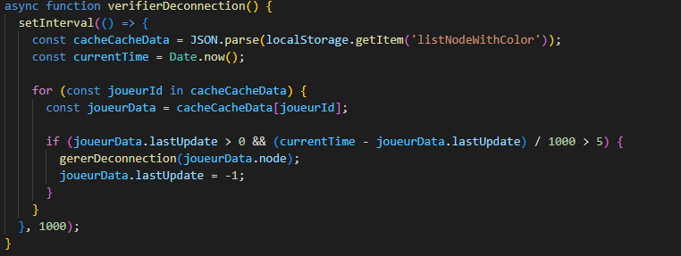

Pour savoir la date de dernière mise-à-jour, à chaque nouveau JSon reçu, on assimile à l'attribut "lastUpdate" le résultat de la fonction Date.now() 

Ensuite, verifierDeconnection regare, pour chaque JSon présent dans le local storage, que l'écart entre lastUpdate et Date.now() est inférieur à 7000ms. Si c'est le cas, et que la table est marquée comme connectée, alors on lui attribue la classe "deconnecte" (qui baisse son opacité à 50%) et un message est également affiché sur l'écran des utilisateurs.

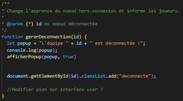

Pour savoir si une l'équipe dont on a reçu le JSon s'est reconnectée, on regarde simplement si sa table associée possède la classe "deconnecte". Le cas échéant, on lui retire cette classe et on affiche un message pour informer que l'équipe s'est reconnectée.

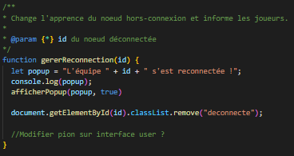

== Envoyer un message

=== Message customisé

Lorsque vous cliquez sur le bouton "message", un prompt va vous demandez le message que vous souhaitez communiquer. Si le message n'est pas vide, il sera affiché sur l'écran des utilisateurs.

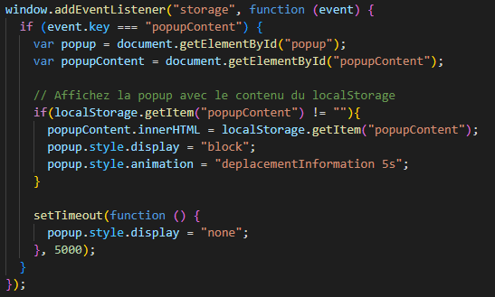

=== Messages programmés

Des messages automatiques sont affichés automatiquement, lorsque :

* Une équipe trouve la moitié des checkpoints
* Une équipe trouve la totalité des checkpoints
* Une équipe se déconnecte
* Une équipe se reconnecte

(non fonctionnel)

== Couleur aléatoire des joueurs
Compare la node qui vient d'être récupéré avec un tableau contenant les nodes ayant déjà une couleur. Si la node est déjà existante il ne se passe rien. Sinon une couleur est générer de manière aléatoire. Ensuite cette couleur est ajouter au json de la node et la node est ajouté au tableau des nodes avec couleurs. 

image:img/génération-couleur.png[]

== Accès Port Série
=== Protocole de communication des données
La Web Serial API permet aux navigateurs web d'établir une communication série avec des périphériques matériels connectés via USB, tels que des microcontrôleurs Arduino.
L'utilisateur autorise l'accès à la Web Serial API, puis la page web peut ouvrir un port série, le configurer, établir une connexion, transmettre et recevoir des données. 
Elle offre des méthodes pour envoyer et recevoir des données, ainsi que des événements pour la gestion asynchrone de la communication série. Une fois la communication terminée,
le port est fermé. 

image:img/lire-port-série.png[]

Demander l'accès au port série :

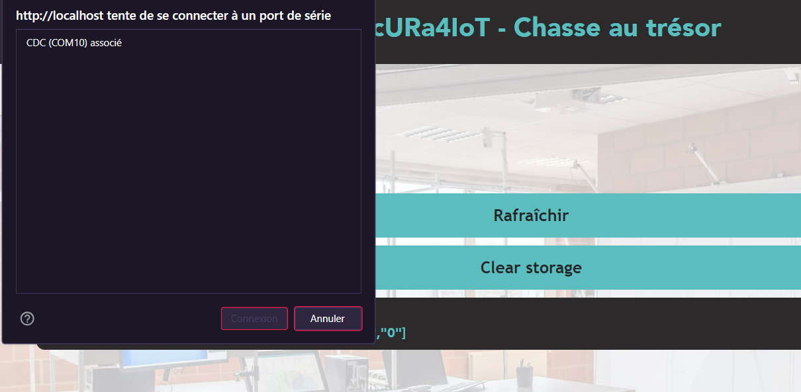

== Adaptabilité
Le code javaScript est réalisé de manière à s'adapter à la taille d'une liste de balise. Plus il y a de balise, plus le plateau de jeu sera grand. La génération des couleurs se fait pour chaque joueur et une couleur ne peut pas être attribuée deux fois.
 