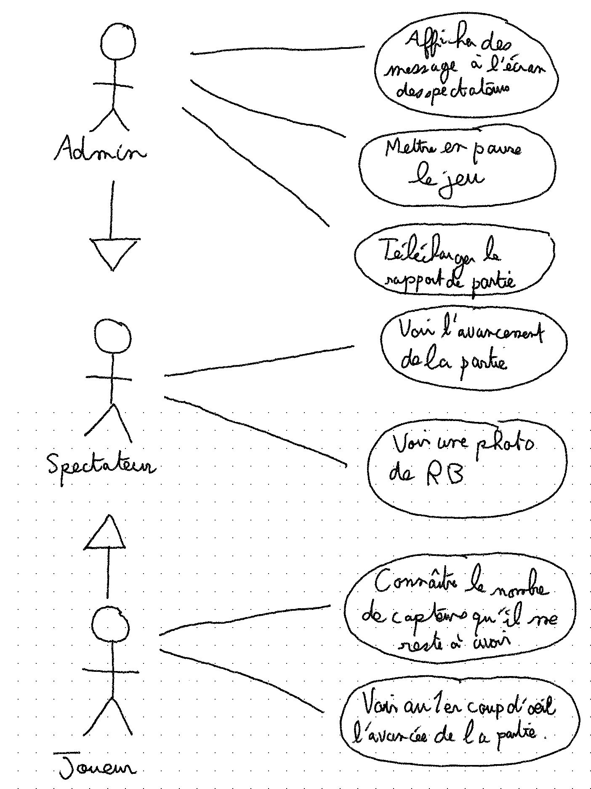
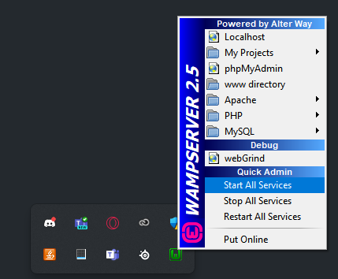
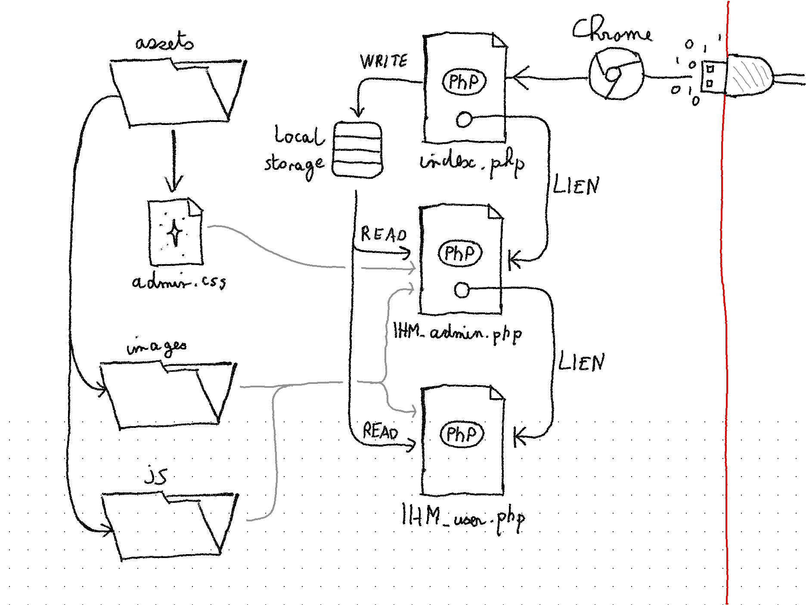
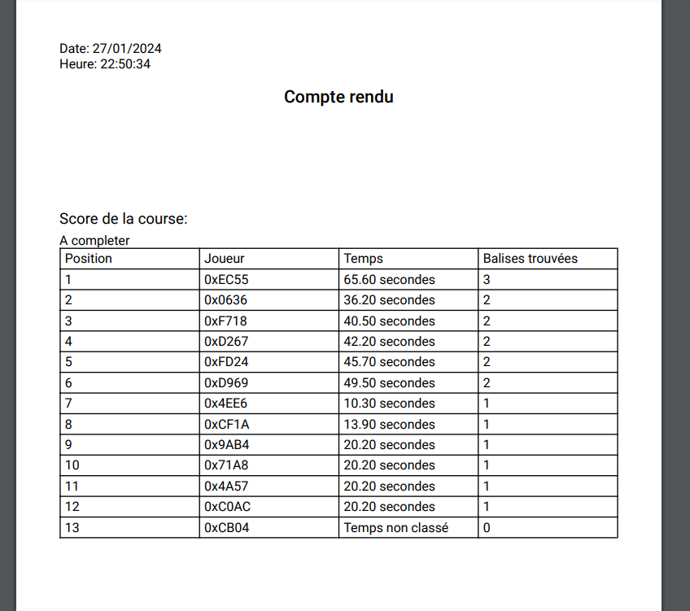
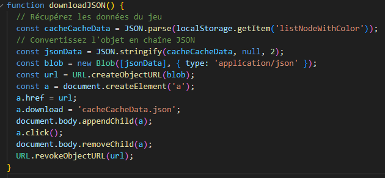
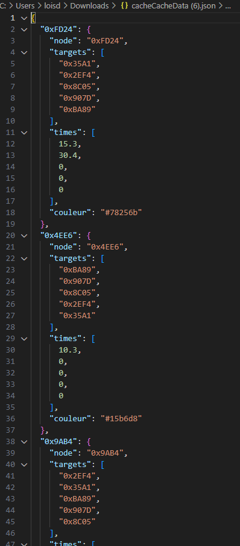

= Documentation Technique
:toc: macro
:toclevels: 3
:toc-title: 
:numbered:

Réalisé par *Thomas Duppi, Loïs Pacqueteau, Vincent Barette, Loélia Demany*

Documentation technique pour le projet de chasse au trésor LocuraIoT

== Sommaire

toc::[]

== Cas d'utilisation général

== Déploiement du projet 

=== Prérequis
Pour lancer l'application, il faut télécharger Wamp pour déployer le projet sur sa propre machine, et l'héberger localement. N'importe quel autre serveur web peut être utilisé, mais Wamp est le plus simple à utiliser.

https://www.wampserver.com/en/download-wampserver-64bits/#download-wrapper[Lien de telechargemnt wamp]

=== Lancement

Une fois Wamp installé, il faut lancer l'application Wamp puis lancer le serveur en cliquant sur l'icône Wamp dans la barre des tâches, puis en cliquant sur "Start All Services".

Ensuite, il faut se rendre dans le dossier www de Wamp, et y cloner le depot GitHub. Le dossier www se trouve dans le dossier d'installation de Wamp, par défaut `C:\wamp64\www`.

Une fois le depot cloné dans le dossier www, il faut se rendre sur la page `localhost/sae-3-01-devapp-g3a-5/Code%20source/` dans son navigateur Google Chrome.

l'application est maintenant déployée sur votre machine.

> /!\ Le projet doit être utilisé avec Google Chrome pour être compatible.

== Architecture Système

=== Dossier du Code Source (`CodeSource`)

Ce dossier contient l'ensemble du code source de l'app.

=== FICHIER HTML

La gestion des données est réalisée en PHP. Les données sont stockées dans des fichiers JSON, eux memes stockés dans le local storage du navigateur.

==== `index.html`

Il s'agit de la page d'accueil du projet. C'est elle qui demande l'accès au port série, et qui gère la communication avec le matériel du jeu.

==== `IHM_admin.html`

Fichier PHP responsable de l'interface utilisateur administrateur.
Gère l'affichage des informations administratives et des statistiques du jeu.
Il permet d'accéder à l'IHM utilisateur.

==== `IHM_user.html`

Fichier PHP responsable de l'interface utilisateur pour les joueurs.
Gère l'affichage de l'interface de jeu, de la progression globale des joueurs, etc.

==== `index.html`

Fichier PHP responsable du lancement du jeu.
Gère l'affichage des sniffeurs et checkpoints connectés, bouton pour démarrer le jeu.

=== `Assets`

Ce dossier contient des ressources utilisées par l'application.

==== `admin.css` & `user.css`

Fichiers CSS contenant les styles de l'application.

==== Dossier `images`

Contient les images utilisées dans l'IHM, telles que des icônes, des logos, etc.

==== Dossier `js`

Ce dossier contient les fichiers JavaScript nécessaires pour l'IHM.

===== `locura4iot.js`

Contient toutes les fonctions Javascript du projet.

==== Communication avec les Données du Jeu via Web Serial

Le fichier JavaScript (`locura4iot.js`) utilise la Web Serial API pour établir une communication avec le matériel du jeu.

== Adaptabilité du plateau de jeu
Le plateau de jeu depends du nombre de balises cachées, il fonctionne avec un tableau html adapté en php. Le seul soucis rencontré a été la génération du tableau car elle se fait de gauche a droite,
or notre plateau doit avoir une forme en serpentin si on a beaucoup de balise donc les lignes pair se gererait mal avec se fonctionnement, la fonction *position* sert donc a attribué l'ordre des 
balises td correctement pour pouvoir donner le bon style a chaque td.

Code de la generation du tableau:

image:img/adaptationtable.png[width=420, height=420]

(on peut voir ici que la boucle for depends de la valeur liste-size)

== Couleur du plateau
la fonction color retourne un string qui sert de classe dans le php afin que le css change la couleur du td  

la fonction color: 

image:img/fonction-color.png[]

l'utilisation dans le code:

image:img/fonction-color2.png[]

le css:

image:img/fonction-color3.png[]

== Génération du PDF de fin de partie

image:img/genererpdf.png[]

pour generer le pdf on utilise la librairie pdfmake qui permet de generer un pdf facilement en javascript. On a donc un "event listener" sur le bouton qui permet de generer le pdf a partir des données du jeu.

Résultat:

== Génération du JSON de la partie

cette fonctionnalité disponible dans l'interface administrateur permet de generer un fichier json contenant les données de la partie en cours. Meme principe que pour le pdf, on a un "event listener" sur le bouton qui permet de generer le json a partir du local storage.

Resultat:

== Données Admin

Dans le local storage sont sauvegardées les données des équipes (utilisables par les admins) et écrites par la page index (cf. Accès Port Série) ci-dessous.

=== Couleur aléatoire des joueurs
Compare la node qui vient d'être récupéré avec un tableau contenant les nodes ayant déjà une couleur. Si la node est déjà existante il ne se passe rien. Sinon une couleur est générer de manière aléatoire. Ensuite cette couleur est ajouter au json de la node et la node est ajouté au tableau des nodes avec couleurs. 

image:img/génération-couleur.png[]

== Accès Port Série
=== Protocole de communication des données
La Web Serial API permet aux navigateurs web d'établir une communication série avec des périphériques matériels connectés via USB, tels que des microcontrôleurs Arduino.
L'utilisateur autorise l'accès à la Web Serial API, puis la page web peut ouvrir un port série, le configurer, établir une connexion, transmettre et recevoir des données. 
Elle offre des méthodes pour envoyer et recevoir des données, ainsi que des événements pour la gestion asynchrone de la communication série. Une fois la communication terminée,
le port est fermé. 

image:img/lire-port-série.png[]

== Evolutivité
Le code php est réalisé de maniere a s'adapter a la taille d'une liste de balise. Plus il y a de balise, plus le plateau de 
jeu sera grand. Pour l'instant on utilise une liste quelquonque mais lorsque la communication en webserial sera 
réalisé on mettra une veritable liste de balise au deuxieme sprint. Si a l'avenir on souhaite faire un jeu comme ca avec beauucoup de 
balise, l'ihm sera fonctionnel!
