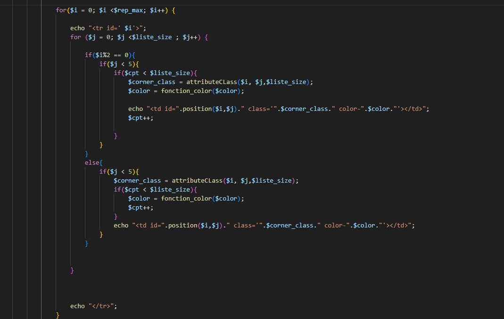
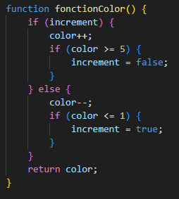
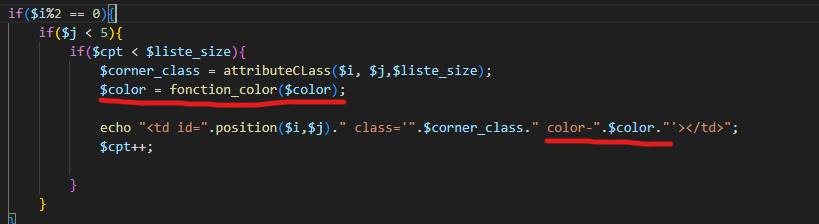
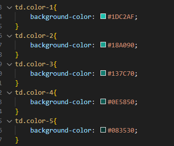
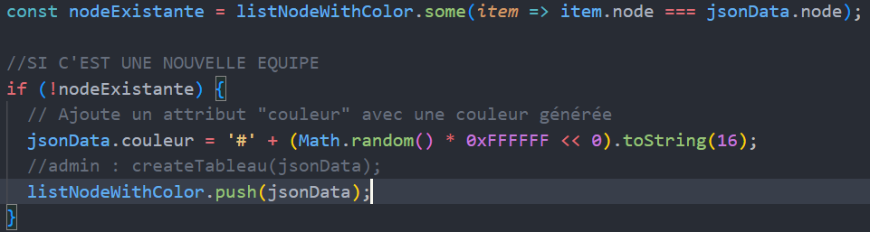
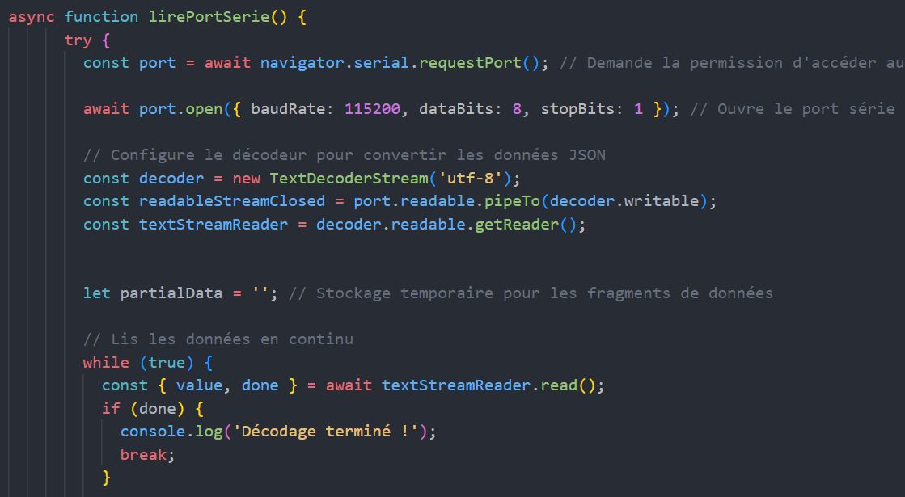

= Documentation Technique
:toc: macro
:toclevels: 3
:toc-title: 

Réalisé par *Thomas Duppi, Loïs Pacqueteau, Vincent Barette, Loélia Demany*

Documentation technique pour le projet de chasse au trésor LocuraIoT

== Sommaire

toc::[]

== Présentation de l'application

=== Contexte

LocURa4IoT a développé un jeu de chasse au trésor : Des joueurs doivent trouver des checkpoints à l'aide d'un noeud, le tout se basant sur la technologie des flux mqtt. Le jeu est actuellement fonctionnel mais manque d'une interface pour faciliter son déroulement. C'est ainsi que nous intervenons :  Nous sommes une équipe de 4 développeurs en alternance chargé de créer une interface destinée aux administrateur, pour visualiser son déroulement et intervenir si besoin, et une interface utilisateur qui sera diffusée à tous les joueurs pour qu'ils aient une idée de l'avancement de la partie.

=== Use cases généraux

image::img/doc_tech_usecase_admingen.png[]

image::img/doc_tech_usecase_usergen.png[]

=== Technologies utilisées

==== Javascript

Principalement utilisé pour rendre les pages web interactives, Javascript permet d'ajouter des fonctionnalités dynamiques, de manipuler le contenu de la page et de réagir aux événements utilisateur. Il s'agit d'un système front parfait pour notre projet puisque nous avons besoin de manipuler des données en temps réel, notamment en déplaçant les pions sur le plateau.

==== PHP

Principalement utilisé pour le développement web, PHP génère du contenu dynamique. Il est souvent intégré dans le code HTML et s'exécute sur le serveur avant que la page ne soit envoyée au navigateur. Généralement, cela permet d'ajouter de la sécurité au projet, mais en l'occurence, le serveur est également le client. Il n'y a donc pas d'aspect de sécurité à prendre en compte. Nous utilisons tout de même PHP pour sa génération dynamique de contenu, contrairement à HTML qui donne du contenu entièrement statique.

==== CSS/SCSS

Utilisé pour définir la présentation visuelle des pages web PHP, le CSS permet de spécifier la mise en forme, les couleurs, les polices, les marges, etc. CSS sépare la structure du contenu HTML de sa présentation. Dans notre projet, il est utilisé principalement pour modifier l'apparance des tableaux, et l'arranger à notre convenance.

== Architecture Système

=== Dossier du Code Source (`CodeSource`)

Ce dossier contient l'ensemble du code source de l'app.

=== Fichiers PHP

==== `IHM_admin.php`

Fichier PHP responsable de l'interface utilisateur administrateur.
Gère l'affichage des informations administratives et des statistiques du jeu. 

==== `IHM_User.php`

Fichier PHP responsable de l'interface utilisateur pour les joueurs.
Gère l'affichage de l'interface de jeu, de la progression globale des joueurs, etc.

==== `index.php`

Fichier PHP responsable du lancement du jeu.
Gère l'affichage des sniffeurs et checkpoints connectés, bouton pour démarrer le jeu.

=== Dossier `assets`

Ce dossier contient des ressources utilisées par l'application.

==== `style.scss`

Fichier SCSS contenant les styles de votre application.
Doit être compilé en CSS pour être utilisé dans les pages PHP.

=== Dossier `images`

Contient les images utilisées dans l'IHM, telles que des icônes, des logos, etc.

=== Dossier `js`

Ce dossier contient les fichiers JavaScript nécessaires pour l'IHM.

==== `admin.js`

Fichier JavaScript spécifique à l'IHM administrateur.
Gère les fonctionnalités administratives et les interactions avec l'IHM_admin.php.

==== `user.js`

Fichier JavaScript spécifique à l'IHM utilisateur.
Gère les fonctionnalités du jeu et les interactions avec l'IHM_User.php.

==== Communication avec les Données du Jeu via Web Serial

Les fichiers JavaScript (`admin.js` et `user.js`) utilisent la Web Serial API pour établir une communication avec le matériel du jeu.

== Adaptabilité du plateau de jeu
Le plateau de jeu depends du nombre de balises cachées, il fonctionne avec un tableau html adapté en php. Le seul soucis rencontré a été la génération du tableau car elle se fait de gauche a droite,
or notre plateau doit avoir une forme en serpentin si on a beaucoup de balise donc les lignes pair se gererait mal avec se fonctionnement, la fonction *position* sert donc a attribué l'ordre des 
balises td correctement pour pouvoir donner le bon style a chaque td.

Code de la generation du tableau:

(on peut voir ici que la boucle for depends de la valeur liste-size)

== Couleur du plateau
la fonction color retourne un string qui sert de classe dans le php afin que le css change la couleur du td  

la fonction color: 

l'utilisation dans le code:

le css:

== Données Admin
=== Couleur aléatoire des joueurs
Compare la node qui vient d'être récupéré avec un tableau contenant les nodes ayant déjà une couleur. Si la node est déjà existante il ne se passe rien. Sinon une couleur est générer de manière aléatoire. Ensuite cette couleur est ajouter au json de la node et la node est ajouté au tableau des nodes avec couleurs. 

== Accès Port Série
=== Protocole de communication
La Web Serial API permet aux navigateurs web d'établir une communication série avec des périphériques matériels connectés via USB, tels que des microcontrôleurs Arduino.
L'utilisateur autorise l'accès à la Web Serial API, puis la page web peut ouvrir un port série, le configurer, établir une connexion, transmettre et recevoir des données. 
Elle offre des méthodes pour envoyer et recevoir des données, ainsi que des événements pour la gestion asynchrone de la communication série. Une fois la communication terminée,
le port est fermé. 

== Evolutivité
Le code php est réalisé de maniere a s'adapter a la taille d'une liste de balise. Plus il y a de balise, plus le plateau de 
jeu sera grand. Pour l'instant on utilise une liste quelquonque mais lorsque la communication en webserial sera 
réalisé on mettra une veritable liste de balise au deuxieme sprint. Si a l'avenir on souhaite faire un jeu comme ca avec beauucoup de 
balise, l'ihm sera fonctionnel!
