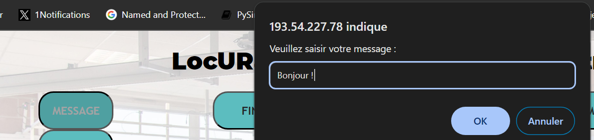

= Documentation Utilisateur - Interface Web de Chasse aux Trésors Numériques
:toc:
:toc-title: Sommaire

Créé par : Pacqueteau Loïs, Duppi Thomas, Demany Loelia, Barette Vincent

== I. Introduction
[.text-justify]
Cette documentation a pour but de vous aider à comprendre le fonctionnement du site de jeu.

== II. Règle du Jeu
[.text-justify]

=== 1. Localisation des Objets
Les équipes s'affrontent pour retrouver des objets connectés disséminés sur la plateforme. Les informations de localisation des objets sont fournies par la plateforme LocURa4IoT.

=== 2. Règles de Recherche
Chaque équipe possède doit trouver tous les checkpoints dans un ordre définit aléatoirement. Chaque équipe doit trouver les checkpoints dans l'ordre qui lui est attribué. Les boities de recherches changent de couleurs et clignotent de plus en plus vite lorsque l'équipe se rapproche de la balise.

=== 3. Conditions de Victoire
Un chronomètre permet de mesurer le temps que chaque équipe mets pour trouver toutes les balises. L'équipe qui trouve toutes les balises en le moins de temps possible remporte la partie.

=== 4. Déroulement du Jeu
1. Les équipes se rassemblent à la balise de départ.
2. Chaque équipe reçoit un boitié qui détecte les balises.
3. Les équipes partent ensuite à la recherche des objets dans la zone désignée.
4. Les équipes doivent signaler chaque objet trouvé à la plateforme LocURa4IoT pour validation.
5. La plateforme met à jour régulièrement les informations de localisation pour maintenir le défi.
6. Une fois que toutes les équipes ont trouvées tout les checkpoints, les équipes retournent à la balise de départ pour la déclaration des résultats.
7. L'équipe avec le temps le plus court remporte la partie.

== III. Pre-Requis :
[.text-justify]
Pour utiliser le jeu, vous devez posséder un ordinateur avec un navigateur web. Vous devez également posséder les boitiers de recherche de balises ainsi que les balises.  Il est aussi nécessaire d'avoir le pont qui permet de lire les données des balises et de les envoyer sur le site web.

== IV. Utilisation de l'application
[.text-justify]

=== Lancement du Site web
Fonctionnalité en cours de développement.
Rendez vous sur le site web à l'adresse suivante :

=== Navigation sur le Site
Fonctionnalité en cours de développement.

=== Interactions sur le Jeu

La majeure partie des interactions avec le jeu se réalisnet à travers l'interface administrateur.

==== Interface Administrateur

===== Rafraîchir Equipes

Il est possible de rafraîchir les équipes de plusieurs manières, en fonction du souhait du client. Le rafraîchissement peut-être automatique, ou manuel (via un bouton).

image::img/refreshbutton.png[Bouton de rafraîchissement]

Exemple - Avant rafraîchissement

image::img/beforerefresh.png[]

// On ne voit que l'équipe A par exemple

Exemple - Après rafraîchissement

image::img/afterrefresh.png[]

// On voit l'équipe A et B par exemple

===== Afficher Message

Vous trouverez un bouton "message". Si vous cliquez dessus, une pop-up vous demandera le contenu de votre message. Confirmez, et il sera affiché sur l'écran des utilisateurs.
Cette fonction est utile pour informer les joueurs que la partie se termine bientôt ou alerter une équipe qu'elle s'est trop éloignée par exemple.

image::img/messagedisplay.png[Affichage du message]

===== Menu Pause

Il est possible de mettre le jeu en pause grâce au bouton associé. Cela permet d'indiquer aux joueurs, sur l'interface utilisateur, qu'ils doivent arrêter leurs recherches, et de synchroniser le temps passé en pause correctement dans les leaderboards.

image::img/pausebutton.png[Bouton Pause]

image::img/nopausemode.png[Sans mode pause]

image::img/pausemode.png[Affichage du mode pause]

===== Voir Données Equipes

La liste des équipes étant disponibles depuis l'interface administrateur, il est possible facilement de s'intéresser à leur détails de progression. On peut notamment observer quels checkpoints ont été trouvés, et en combien de temps.

image::img/viewteamdata.png[Données d'une équipe]

==== Interface de lancement du jeu

> AKA - index.php
Il s'agit de l'interface utilisée pour s'assurer que le jeu est prêt à être lancé. Il contient principalement des informations en lecture.

===== Accès Interface Admin

On peut accéder à l'interface d'administrateur du jeu depuis la page d'index. Il suffit de cliquer sur un bouton.

image::img/accessadmin.png[Bouton d'accès à l'interface admin]

===== Voir Checkpoints Connectés

Il s'agit d'une fonctionnalité de lecture pour s'assurer que le jeu est prêt. En effet, elle permet de voir quels checkpoints sont connectés, avant de démarrer le jeu.

image::img/viewcheckpoints.png[Exemple de liste de checkpoints]

===== Voir Sniffeurs Connectés

Liste des sniffeurs (AKA équipes) connectées, depuis la page d'index/

image::img/afterrefresh.png[Exemple de liste de sniffeurs connectés]

==== Interface Utilisateur/Spectateur

===== Plateau Adaptation Taille

La taille du plateau s'adapte automatiquement au nombre de checkpoints. En effet, lorsque l'on se trouve sur la page d'accueil (index), et qu'on souhaite accéder au plateau du jeu, le Javascript de la page d'accueil fournit au PHP de l'interface utilisateur le nombre de cases. Le plateau est en réalité un tableau PHP, dont l'apparance est modifiée avec du SCSS. Lorsque la page se charge, le PHP crée le tableau et lui attribue non seulement le bon nombre de case, mais aussi dans le bon ordre.

image::img/plateau6.png[Plateau de taille 6]

image::img/plateau11.png[Plateau de taille 11]

===== Couleur Plateau

En harmonie avec la taille du plateau, la couleur du plateau est très importante. Elle permet d'améliorer la visibilité et la compréhension du jeu, et surtout l'accessibilité. La couleur du plateau est une échelle de bleu, conformément à la charte graphique du client. Les cases partent d'un bleu clair, à un bleu foncé, pour revenir au clair. Cela fait une boucle.

image::img/plateau6.png[Plateau de taille 6]

==== Divers

Pour les fonctionnalités qui ne rentrent dans aucune, ou plusieurs catégories.

===== Equipe Connexion

Lorsqu'un sniffeur se connecte, il peut être vu depuis :
 - l'interface admin (comme une équipe) ;
 - l'interface utilisateur (comme un pion) ;
 - la page d'index (dans la liste).

image::img/viewteamdata.png[Interface administrateur]
image::img/indexteamconnection.png[Interface utilisateur]
image::img/afterrefresh.png[Index]

=== Personnalisation des Paramètres
Fonctionnalité en cours de développement.
