= Documentation Utilisateur - Interface Web de Chasse aux Trésors Numériques
:toc:
:toc-title: Sommaire

Créé par : Pacqueteau Loïs, Duppi Thomas, Demany Loélia, Barette Vincent

== I. Introduction
[.text-justify]
Cette documentation a pour but de vous aider à comprendre le fonctionnement de l'interface de jeu.

== II. Règles du Jeu
[.text-justify]

=== 0. Fonctionnement des boitiers
A intervalle réguliers, les boitiers envoient des JSON contenant :

* L'id du noeud (de la forme '0x????')
* Les id des checkpoints, dans l'ordre dans lequel l'équipe doit les trouver
** A noter que les équipes doivent trouver les même checkpoints, dans un ordre différent, excepté pour le checkpoint final qui est le même pour toutes les équipes.
* Le temps mit pour trouver chaque checkpoint, depuis le début de la partie 
** Par exemple, si une équipe trouve un checkpoint au bout de 10 seconde de jeu, et un autre 15 secondes plus tard, le second checkpoint sera considéré comment ayant été trouvé au bout de 25 secondes.

=== 1. Localisation des Objets
Le but du jeu est de retrouver des objets connectés disséminés sur la plateforme. Les informations de localisation des objets sont fournies par la plateforme LocURa4IoT.

=== 2. Règles de Recherche
Chaque équipe doit trouver tous les checkpoints dans un ordre défini aléatoirement. (A noter qu'il est également possible de jouer à ce jeu en solitaire.) Chaque équipe doit trouver les checkpoints dans l'ordre qui lui est attribué. Les boitiers de recherche changent de couleur et clignotent de plus en plus vite lorsque l'équipe se rapproche de la balise.

=== 3. Conditions de Victoire
Un chronomètre permet de mesurer le temps que chaque équipe mets pour trouver toutes les balises. L'équipe qui trouve toutes les balises en le moins de temps possible remporte la partie.

=== 4. Déroulement du Jeu
1. Les équipes se rassemblent à la balise de départ.
2. Chaque équipe reçoit un boitier qui détecte les balises.
3. Les équipes partent ensuite à la recherche des objets dans la zone où ils ont été cachés.
4. Si un boitier se trouve à moins de 30cm de distance pendant 5 secondes, il est considéré trouvé.
5. La plateforme met à jour régulièrement les informations de localisation pour maintenir le défi.
6. Une fois que toutes les équipes ont trouvées tout les checkpoints, les équipes retournent à la balise de départ pour la déclaration des résultats.
7. L'équipe avec le temps le plus court remporte la partie.

== III. Installation du jeu

=== 1. Pré-requis
[.text-justify]
Pour utiliser le jeu, vous devez posséder un ordinateur avec Chrome (ou Edge, Opera...). Vous devez également posséder les boitiers de recherche de balises ainsi que les balises. Il est aussi nécessaire d'avoir le pont qui permet de lire les données des balises et de les envoyer sur le site web.

> /!\ Le projet doit absolument être utilisé sur un des navigateurs cités, car ce sont à l'heure actuelle les seuls à supporter le webserial 

> /!\ On utilise le microcontrolleur PROGRAMMÉ, le microcontrolleur standard ne fonctionne pas...  

=== 2. Installation de l'application

Le fichier code source est disponible ici: 
https://www.github.com/LoisPacqueteau/LocuraIoT[Code source]

Pour l'installer, rien de plus simple, téléchargez le code source et ouvrez le fichier `index.html` dans votre navigateur.

== IV. Utilisation de l'application
[.text-justify]

=== 1. Lancement du Site web
Ouvrez <<installation, l'application>>. 
Vous arriverez sur la page index. Cliquez sur "Lancer lecture des données" et sélectionnez le port utilisé pour la carte programmable lectrice de données. Si vous avez ouvert le mauvais port, cliquez sur le bouton "Clear storage"

=== Navigation sur le Site
Pour accéder à l'interface administrateur, cliquez sur le bouton "Commencer la partie" présent sur la page index.

> Le bouton "Commencer la partie" apparaît dès qu'on détecte 1 joueur ou plus.

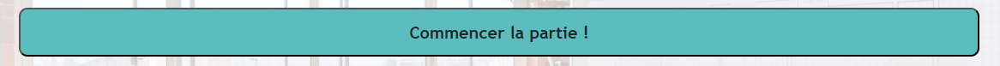

> /!\ Ne pas fermer la page index ! C'est elle qui se charge de la lecture des données.

Depuis la page administrateur, vous pouvez accéder à l'interface utilisateur en cliquant sur le bouton "IHM User"

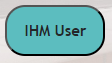

=== Interactions sur le Jeu

La majeure partie des interactions avec le jeu se réalisent à travers <<ihmadmin, l'interface administrateur>>.

==== Index

===== Voir Sniffeurs Connectés

Liste des sniffeurs (AKA équipes) connectées, depuis la page d'index.

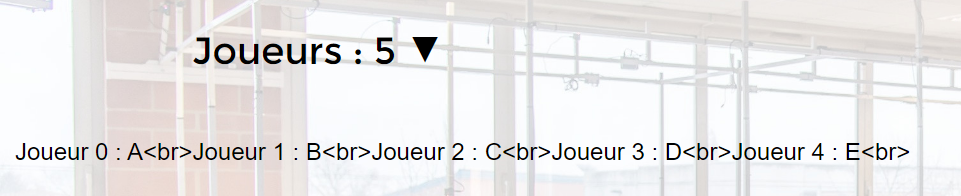

===== Voir Checkpoints Connectés

Il s'agit d'une fonctionnalité de lecture pour s'assurer que le jeu est prêt. En effet, elle permet de voir quels checkpoints sont connectés, avant de démarrer le jeu.

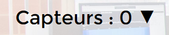

===== Lecture des données

Lorsque vous arrivez sur le jeu, vous devez sélectionner le port connecté à la carte lisant des données. Une fois cela fait, le bouton disparaît et est remplacé par un bouton rafraîchir. Si vous avez sélectionné le mauvais port/aucun port, relancez la page.
C'est la page index qui se charge de la lecture des données, par conséquence, *elle ne doit pas être fermée.*

===== Rafraîchissement

Avant de commencer la partie, l'administrateur peut s'assurer que tous les joueurs et tous les trésors sont captés avec succès.

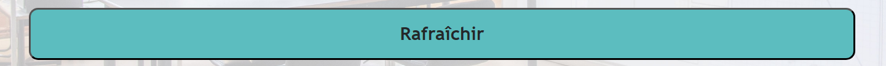

Exemple - Avant rafraîchissement

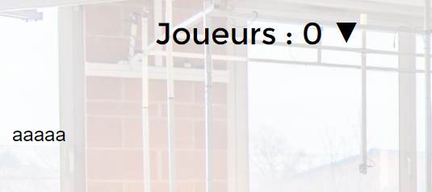

// On ne voit aucune équipe

Exemple - Après rafraîchissement

// On voit les équipes

===== Clear storage

Le bouton "Clear storage" permet d'effacer les données des parties précédentes encore présente dans le local storage.

===== Console

Ici sont affichés tous les Json récupérés en temps réel. La console sert au débuggage.

===== Accès Interface Admin

On peut accéder à l'interface d'administrateur du jeu depuis la page d'index. Ce bouton apparaît lorsqu'on détecte au moins 1 joueur.

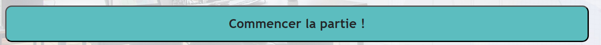

==== Interface administrateur
[[ihmadmin]]

===== Afficher Message

Vous trouverez un bouton "message". Si vous cliquez dessus, une pop-up vous demandera le contenu de votre message. Confirmez, et il sera affiché sur l'écran des utilisateurs.
Cette fonction est utile pour informer les joueurs en temps réel.

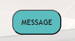

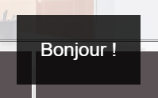

> /!\ Des messages automatiques sont programmés, pour prévenir qu'une équipe a trouvé la moitié des capteurs, a fini la partie ou s'est déconnectée/reconnectée.

===== Télécharger JSon

Vous pouvez télécharger le JSon contenant toutes les informations de la partie à l'heure actuelle à tout moment.

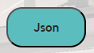

===== Menu Pause

Il est possible de mettre le jeu en pause grâce au bouton associé. Cela permet d'indiquer aux joueurs, sur l'interface utilisateur, qu'ils doivent arrêter leurs recherches. Le bouton pause n'a pas de réelle fonctionnalité, il est purement esthétique, il faut compter sur la bonne foi des joueurs de ne pas continuer à jouer lorsque le jeu est en pause. Pour relancer la partie, cliquez sur l'icône pause.

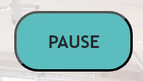

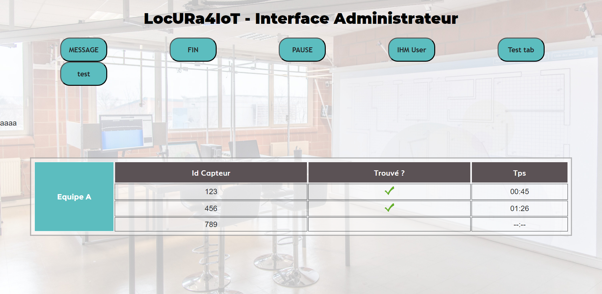

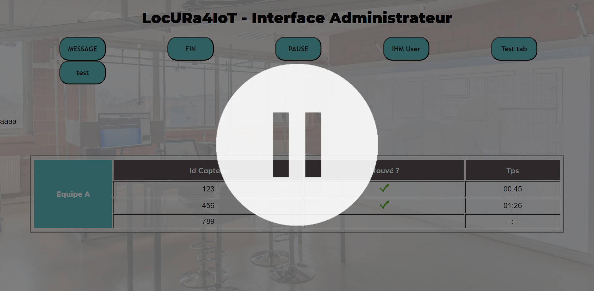

===== Voir Données Equipes

La liste des équipes étant disponibles depuis l'interface administrateur, il est possible facilement de s'intéresser aux détails de leur progression. On peut notamment observer quels checkpoints ont été trouvés, et en combien de temps.

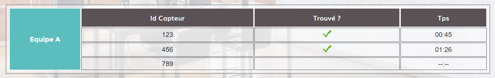

==== Interface Utilisateur

===== Plateau de jeu

L'intérêt principal de l'interface utilisateur est le plateau de jeu. Projeté sur un écran visible de tous, il permet aux joueurs et aux spectateurs d'avoir un aperçu global de la partie.

Le tableau est adaptatif, il se génère en fonction du nombre de capteurs en forme de serpentin.

> Le nombre de case est égal au nombre de checkpoints à trouver + 1 (pour le départ)

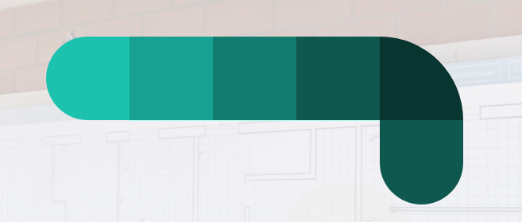

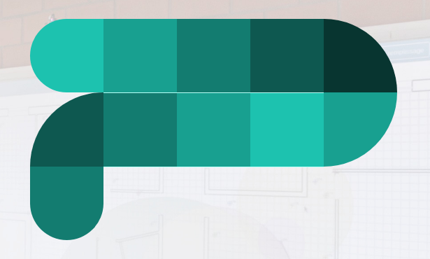

===== Podium

En haut de la page se trouve le podium avec les 3 joueurs les plus avancés (ceux ayant trouvé le plus de capteur en moins de temps). Il est dynamique, il s'adapte en temps réel

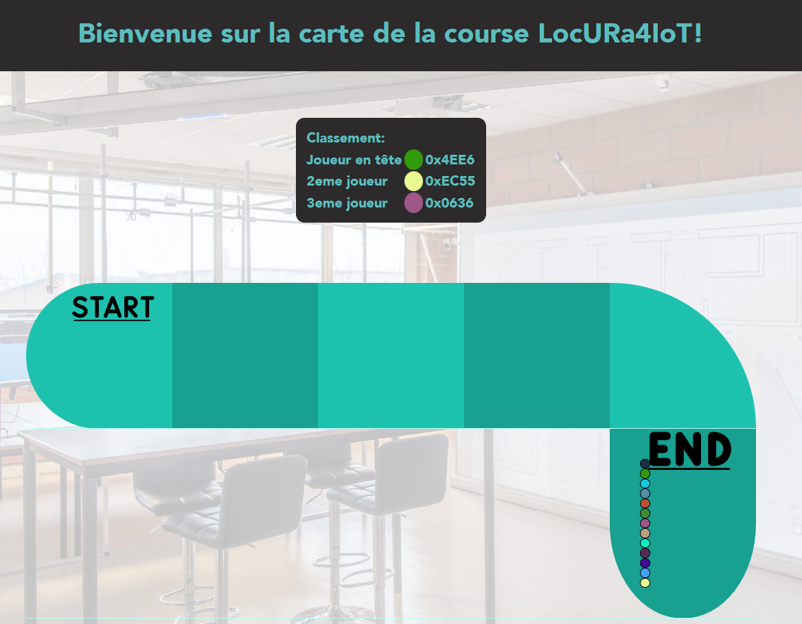

===== Pop-up de fin de partie

Dès qu'un joueur trouve tous les capteurs, une pop-up nous en informe, affiche le podium et nous propose de télécharger le résumé de la partie en PDF et/ou en JSon.

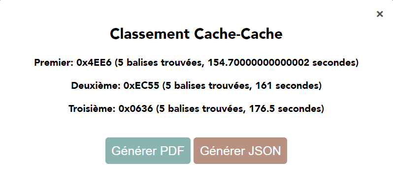

==== Autres

Pour les fonctionnalités qui ne rentrent dans aucune, ou plusieurs catégories.

===== Equipe Connexion

Lorsqu'un sniffeur se connecte, il peut être vu depuis :

* l'interface admin (comme une équipe) ;
* l'interface utilisateur (comme un pion) ;
* la page d'index (dans la liste).

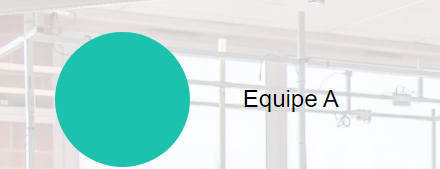

===== Déconnexion d'une équipe

Lorsqu'une équipe se déconnecte (Joueur hors de portée, noeud déchargé...) les participants au jeu en sont informés : un message est lancé automatiquement sur l'interface utilisateur et le tableau correspondant à l'équipe dans l'interface utilisateur est mit en transparence.

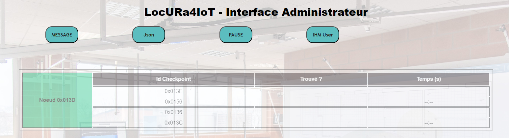

Si l'équipe se reconnecte, l'apparence de l'équipe revient à la normale et un message est lancé sur l'interface user pour prévenir les joueurs.
