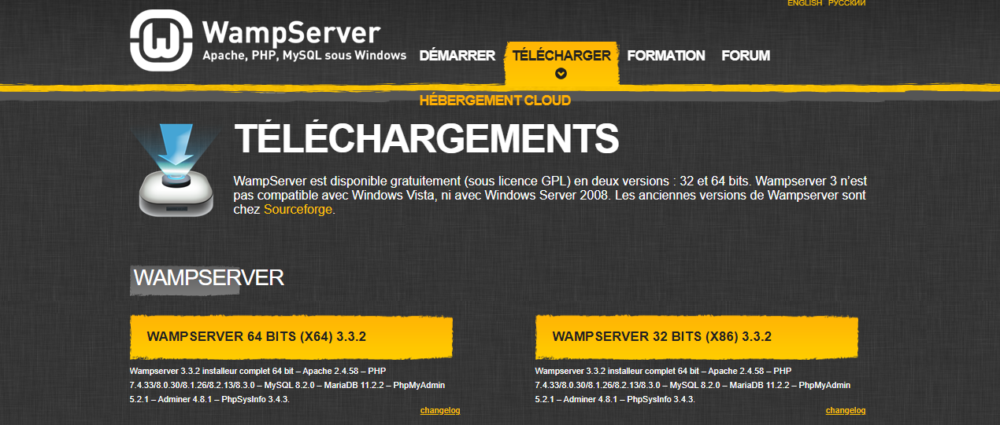
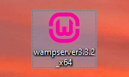

= Documentation Utilisateur - Interface Web de Chasse aux Trésors Numériques
:toc:
:toc-title: Sommaire

Créé par : Pacqueteau Loïs, Duppi Thomas, Demany Loélia, Barette Vincent

== I. Introduction
[.text-justify]
Cette documentation a pour but de vous aider à comprendre le fonctionnement de l'interface de jeu.

== II. Règles du Jeu
[.text-justify]

=== 0. Fonctionnement des boitiers
A intervalle réguliers, les boitiers envoient des JSON contenant :

* L'id du noeud (de la forme '0x????')
* Les id des checkpoints, dans l'ordre dans lequel l'équipe doit les trouver
** A noter que les équipes doivent trouver les même checkpoints, dans un ordre différent, excepté pour le checkpoint final qui est le même pour toutes les équipes.
* Le temps mit pour trouver chaque checkpoint, depuis le début de la partie 
** Par exemple, si une équipe trouve un checkpoint au bout de 10 seconde de jeu, et un autre 15 secondes plus tard, le second checkpoint sera considéré comment ayant été trouvé au bout de 25 secondes.

=== 1. Localisation des Objets
Les équipes s'affrontent pour retrouver des objets connectés disséminés sur la plateforme. Les informations de localisation des objets sont fournies par la plateforme LocURa4IoT.

=== 2. Règles de Recherche
Chaque équipe possède doit trouver tous les checkpoints dans un ordre défini aléatoirement. (A noter qu'il est également possible de jouer à ce jeu en solitaire.) Chaque équipe doit trouver les checkpoints dans l'ordre qui lui est attribué. Les boitiers de recherche changent de couleur et clignotent de plus en plus vite lorsque l'équipe se rapproche de la balise.

=== 3. Conditions de Victoire
Un chronomètre permet de mesurer le temps que chaque équipe mets pour trouver toutes les balises. L'équipe qui trouve toutes les balises en le moins de temps possible remporte la partie.

=== 4. Déroulement du Jeu
1. Les équipes se rassemblent à la balise de départ.
2. Chaque équipe reçoit un boitier qui détecte les balises.
3. Les équipes partent ensuite à la recherche des objets dans la zone où ils ont été cachés.
4. Si un boitier se trouve à moins de 30cm de distance pendant 5 secondes, il est considéré trouvé.
5. La plateforme met à jour régulièrement les informations de localisation pour maintenir le défi.
6. Une fois que toutes les équipes ont trouvées tout les checkpoints, les équipes retournent à la balise de départ pour la déclaration des résultats.
7. L'équipe avec le temps le plus court remporte la partie.

== III. Installation du jeu

=== 1. Pré-requis
[.text-justify]
Pour utiliser le jeu, vous devez posséder un ordinateur avec chrome et l'application "WampServer". Vous devez également posséder les boitiers de recherche de balises ainsi que les balises. Il est aussi nécessaire d'avoir le pont qui permet de lire les données des balises et de les envoyer sur le site web.

> /!\ Le projet doit être utilisé avec Google Chrome pour être compatible.

=== 2. Installation 

== IV. Utilisation de l'application
[.text-justify]

=== Lancement du Site web
Ouvrez <<installation, l'application>>. 
Vous arriverez sur la page index. Cliquez sur "Lancer lecture des données" et sélectionnez le port utilisé pour la carte programmable lectrice de données.

=== Navigation sur le Site
Pour accéder à l'interface administrateur, cliquez sur le bouton "Commencer la partie" présent sur la page index.

Pour lancer l'application, il faut télécharger Wamp pour déployer le projet sur sa propre machine, et l'héberger localement. N'importe quel autre serveur web peut être utilisé, mais Wamp est le plus simple à utiliser.

https://www.wampserver.com/en/download-wampserver-64bits/#download-wrapper[Lien de telechargement wamp]

Vous devriez obtenir un fichier comme cela :

Lancez-le et suivez les instructions pour installer Wamp.

=== Lancement

Une fois Wamp installé, il faut lancer l'application Wamp puis lancer le serveur en cliquant sur l'icône Wamp dans la barre des tâches, puis en cliquant sur "Start All Services".

image::img/wamp.png[]

Ensuite, il faut se rendre dans le dossier www de Wamp, et y créer un dossier "LocuraIoT". C'est dans ce dossier que l'on va placer le code source du projet.

Le fichier code source est disponible ici: 
https://www.github.com/LoisPacqueteau/LocuraIoT[Code source]

Une fois le code source placé dans le dossier LocuraIoT, il faut se rendre sur la page `localhost/Code%20source/` dans son navigateur Google Chrome.

l'application est maintenant installé sur votre machine.

=== Navigation sur le Site

Une barre des taches sur l'IHM Administateur permet de naviguer entre les différentes pages du site.

image::img/commencerpartie.PNG[]

/!\ Ne pas fermer la page index ! C'est elle qui se charge de la lecture des données.

Depuis la page administrateur, vous pouvez accéder à l'interface utilisateur en cliquant sur le bouton "IHM User"

image::img/btnihmuser.PNG[]

=== Interactions sur le Jeu

La majeure partie des interactions avec le jeu se réalisent à travers l'interface administrateur.

==== Index

===== Rafraîchissement

Avant de commencer la partie, l'administrateur peut s'assurer que tous les joueurs et tous les trésors sont captés avec succès.

image::img/refreshbutton.png[Bouton de rafraîchissement]

Exemple - Avant rafraîchissement

image::img/beforerefresh.png[]

// On ne voit que l'équipe A par exemple

Exemple - Après rafraîchissement

image::img/afterrefresh.png[]

// On voit l'équipe A et B par exemple

===== Accès Interface Admin

On peut accéder à l'interface d'administrateur du jeu depuis la page d'index. Ce bouton apparaît lorsqu'on détecte au moins 1 joueur.

image::img/accessadmin.png[Bouton d'accès à l'interface admin]

===== Voir Checkpoints Connectés

Il s'agit d'une fonctionnalité de lecture pour s'assurer que le jeu est prêt. En effet, elle permet de voir quels checkpoints sont connectés, avant de démarrer le jeu.

image::img/viewcheckpoints.png[Exemple de liste de checkpoints]

===== Voir Sniffeurs Connectés

Liste des sniffeurs (AKA équipes) connectées, depuis la page d'index/

image::img/afterrefresh.png[Exemple de liste de sniffeurs connectés]

==== Interface administrateur

===== Afficher Message

Vous trouverez un bouton "message". Si vous cliquez dessus, une pop-up vous demandera le contenu de votre message. Confirmez, et il sera affiché sur l'écran des utilisateurs.
Cette fonction est utile pour informer les joueurs que la partie se termine bientôt ou alerter une équipe qu'elle s'est trop éloignée par exemple.

image::img/btnmessage.png[Bouton Message]

image::img/messagedisplay.png[Affichage du message]

===== Menu Pause

Il est possible de mettre le jeu en pause grâce au bouton associé. Cela permet d'indiquer aux joueurs, sur l'interface utilisateur, qu'ils doivent arrêter leurs recherches. Le bouton pause n'a pas de réelle fonctionnalité, il est purement esthétique, il faut compter sur la bonne foi des joueurs de ne pas continuer à jouer lorsque le jeu est en pause

image::img/pausebutton.png[Bouton Pause]

image::img/nopausemode.png[Sans mode pause]

image::img/pausemode.png[Affichage du mode pause]

===== Voir Données Equipes

La liste des équipes étant disponibles depuis l'interface administrateur, il est possible facilement de s'intéresser à leur détails de progression. On peut notamment observer quels checkpoints ont été trouvés, et en combien de temps.

image::img/viewteamdata.png[Données d'une équipe]

==== Interface Utilisateur/Spectateur

===== Plateau Adaptation Taille

La taille du plateau s'adapte automatiquement au nombre de checkpoints. En effet, lorsque l'on se trouve sur la page d'accueil (index), et qu'on souhaite accéder au plateau du jeu, le Javascript de la page d'accueil fournit au PHP de l'interface utilisateur le nombre de cases. Le plateau est en réalité un tableau PHP, dont l'apparance est modifiée avec du SCSS. Lorsque la page se charge, le PHP crée le tableau et lui attribue non seulement le bon nombre de case, mais aussi dans le bon ordre.

image::img/plateau6.png[Plateau de taille 6]

image::img/plateau11.png[Plateau de taille 11]

===== Couleur Plateau

En harmonie avec la taille du plateau, la couleur du plateau est très importante. Elle permet d'améliorer la visibilité et la compréhension du jeu, et surtout l'accessibilité. La couleur du plateau est une échelle de bleu, conformément à la charte graphique du client. Les cases partent d'un bleu clair, à un bleu foncé, pour revenir au clair. Cela fait une boucle.

image::img/plateau6.png[Plateau de taille 6]

==== Divers

Pour les fonctionnalités qui ne rentrent dans aucune, ou plusieurs catégories.

===== Lecture des données

Lorsque vous arrivez sur le jeu, vous devez sélectionner le port connecté à la carte lisant des données. Une fois cela fait, le bouton disparaît et est remplacé par un bouton rafraîchir. Si vous avez sélectionné le mauvais port/aucun port, relancez la page.
C'est la page index qui se charge de la lecture des données, par conséquence, *elle ne doit pas être fermée.*

===== Equipe Connexion

Lorsqu'un sniffeur se connecte, il peut être vu depuis :

* l'interface admin (comme une équipe) ;
* l'interface utilisateur (comme un pion) ;
* la page d'index (dans la liste).

image::img/viewteamdata.png[Interface administrateur]
image::img/indexteamconnection.png[Interface utilisateur]
image::img/afterrefresh.png[Index]

===== Déconnexion d'une équipe

Lorsqu'une équipe se déconnecte (Joueur hors de portée, noeud déchargé...) les participants au jeu en sont informés : un message est lancé automatiquement sur l'interface utilisateur et le tableau correspondant à l'équipe dans l'interface utilisateur est mit en transparence.

image::img/tabdeco.png[Tableau déconnecté]

Si l'équipe se reconnecte, l'apparence de l'équipe revient à la normale et un message est lancé sur l'interface user pour prévenir les joueurs.